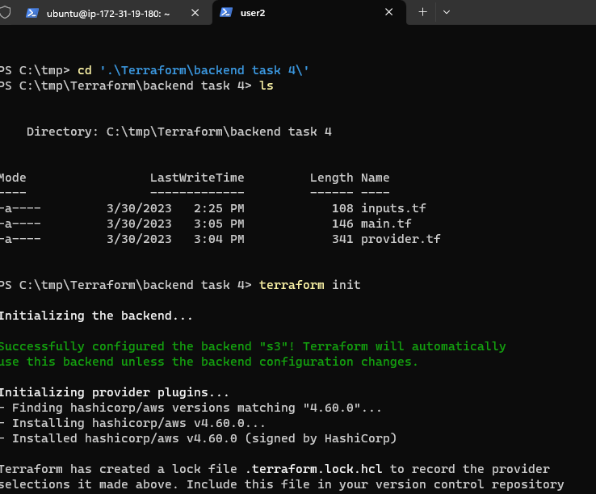
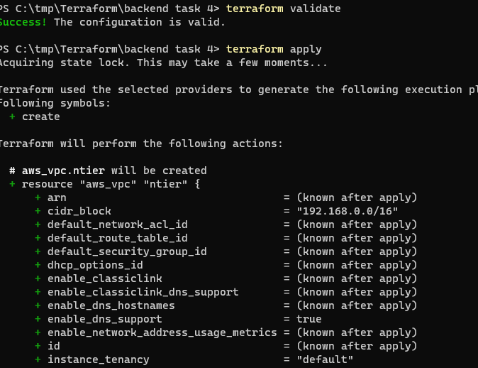
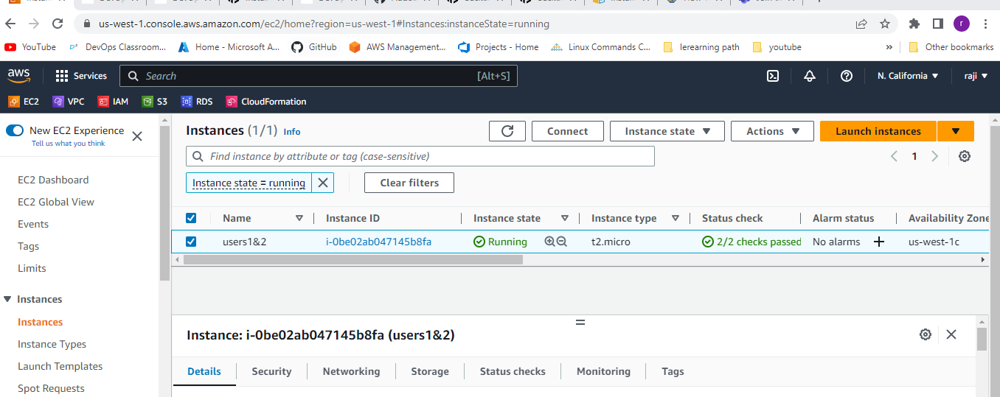
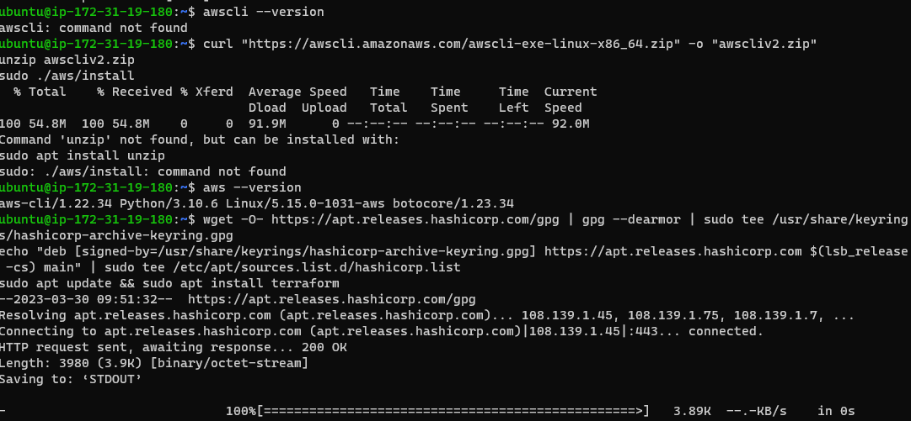
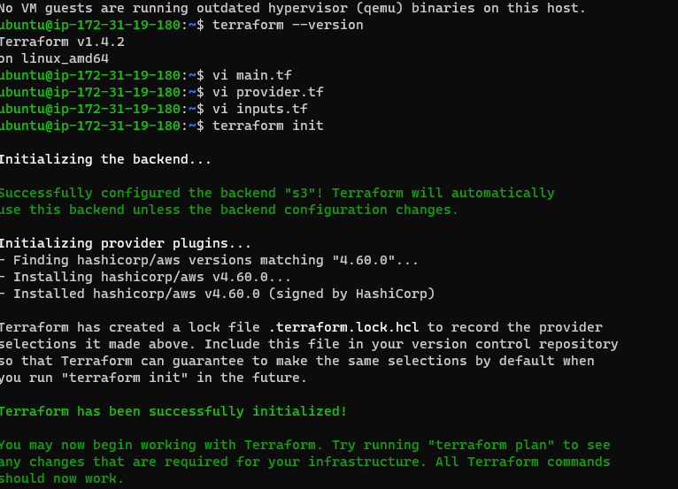

# Introduction:
----------------
There are two types of file local and remote we are checking whether the file is allow
To configure a backend, add a nested backend block within the top-level terraform block. The following example configures the remote backend. There are some important limitations on backend configuration: A configuration can only provide one backend block.
# Pre-requests: 
--------------
* vscode
* ec2 machine (user1)
* local user (user2)

```
create a folder in any of the drive eg: (c or d) 
Now create a 3 files in vscode 

''''''''
main.tf (for resources)
--------------------------
provider "aws" {
    region = "us-west-1"
}
resource "aws_vpc" "ntier" {
  cidr_block = "192.168.0.0/16"
  tags = {
    Name = "ntier"
  }
}
# provider.tf (for provider)
-------------------------------
terraform {
    required_providers {
      aws = {
        source  = "hashicorp/aws"
        version = "4.60.0"
      }
    }
    required_version = "> 1.0.0"
    backend "s3" {
      bucket         = "backendbucket789"
      key            = "backend_task4/main.tf"
      dynamodb_table = "terraformlock1"
      region         = "us-west-1"
  
    }
  }
  
# inputs.tf (for variables) 
--------------------------------
variable "region" {
    type = string
    default = "us-west-1"
    description = "resource region "
}

local user go to path and then 
   "PS C:\tmp\Terraform\backend task 4>  " this is the path where we execute 
   terraform init
```


  terraform validate 
  terraform apply 
 

'''
Now get into user 2 i.e is linux (ubuntu )machine which has awscli and terraform installations 

 


$ sudo apt update
$ sudo apt install awscli 
$ curl "https://awscli.amazonaws.com/awscli-exe-linux-x86_64.zip" -o "awscliv2.zip"
unzip awscliv2.zip
sudo ./aws/install
$ aws --version
$ aws configure 

install terraform (use this command to download it) 

wget -O- https://apt.releases.hashicorp.com/gpg | gpg --dearmor | sudo tee /usr/share/keyrings/hashicorp-archive-keyring.gpg
echo "deb [signed-by=/usr/share/keyrings/hashicorp-archive-keyring.gpg] https://apt.releases.hashicorp.com $(lsb_release -cs) main" | sudo tee /etc/apt/sources.list.d/hashicorp.list
sudo apt update && sudo apt install terraform 

vi main.tf 
vi provider.tf
vi inputs.tf 
 

Now run the command terraforms
terraform init (initilize the provider)
terraform validate (validate the structure of whole file weather the file is valid or not)
terraform apply (applies the execution part it will show the valuse of each resource then check in the aws automation will be done in ur account)
terraform destroy ( it destroy all which we create ) 


* It will show the added 0 files in linux machine because the file already added in windows terminal so you cant see the changes in linux machine (ubuntu)